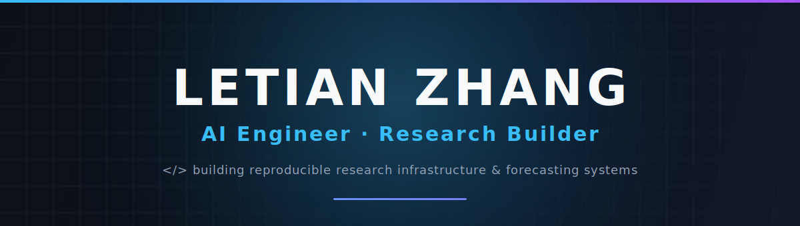
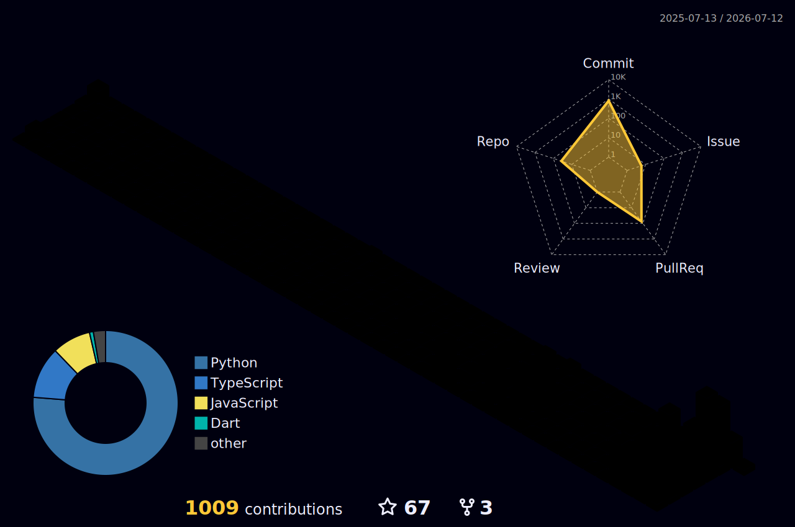

# LETIAN ZHANG

---

## Mission Brief

> CS Student building systems at the intersection of **time series forecasting**, **power markets**, and **automated research infrastructure**.

I don't do generic full-stack. I build specialized systems for:

- **Time Series Forecasting** — NSE optimization, experiment audit, benchmarking pipelines  
- **Power Markets & Energy Systems** — electricity price forecasting, microgrid optimization, demand-side analytics  
- **Automated Research Tools** — AI-driven literature mining, paper generation pipelines, experiment orchestration  
- **Forecasting Experiment Infrastructure** — reproducible, monitorable, and tunable research workflows  

If it involves predicting the future from data or automating the research process, I'm interested.

---

## System Boot

---

## Research Stack

  

---

## Mission Modules

  

---

## GitHub Command Center

---

---

## Research Metrics

 Metrics - generated weekly by .github/workflows/metrics.yml 

---

## Contribution Signal

 

 3D Contribution Graph - generated by profile-3d.yml workflow 
 Go to Actions > 3D Contribution Graph and run workflow manually 
 Then uncomment below: 
 

 

---

  

### *Building systems that turn data into foresight, and papers into pipelines.*

 

 DAILY-BOT:START 
## ⚡ GitHub Public Contribution Command Center

> Status: SAFE MODE
> Scope: PUBLIC REPOS ONLY
> Private repo access: BLOCKED
> Last update: 2026-06-21

### 今日作战状态

| 指标 | 数量 |
|---|---:|
| 扫描 public 仓库 | 3 |
| 跳过 private/internal 仓库 | 0 |
| 外部 issue 候选 | 0 |
| 生成 patch 草稿 | 0 |
| 创建公开 PR | 0 |
| 外部评论 | 0 |

### 今日推荐行动

- (今日无新增推荐行动 — 见 reports/2026-06-21.md)

 DAILY-BOT:END

<!-- DAILY-BOT:START -->
## ⚡ GitHub Public Contribution Command Center

> Status: SAFE MODE
> Scope: PUBLIC REPOS ONLY
> Private repo access: BLOCKED
> Last update: 2026-06-30

### 今日作战状态

| 指标 | 数量 |
|---|---:|
| 扫描 public 仓库 | 3 |
| 跳过 private/internal 仓库 | 0 |
| 外部 issue 候选 | 85 |
| 生成 patch 草稿 | 0 |
| 创建公开 PR | 0 |
| 外部评论 | 0 |

### 今日推荐行动

- (今日无新增推荐行动 — 见 reports/2026-06-30.md)

<!-- DAILY-BOT:END -->
